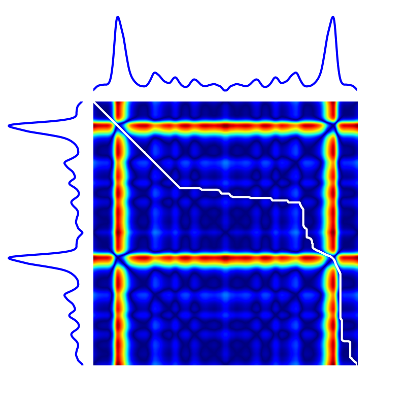

---
jupyter:
  jupytext:
    formats: ipynb,md,Rmd,py:percent
    text_representation:
      extension: .md
      format_name: markdown
      format_version: '1.1'
      jupytext_version: 1.2.1
  kernelspec:
    display_name: Python 3
    language: python
    name: python3
---

# Dynamic Time Warping

This section covers my works related to Dynamic Time Warping for time series.

<!-- #region {"tags": ["popout"]} -->
**Note.** In ``tslearn``, such time series would be represented as arrays of
respective
shapes `(n, p)` and `(m, p)` and DTW can be computed using the following code:

```python
from tslearn.metrics import dtw, dtw_path

dtw_score = dtw(x, x_prime)
# Or, if the path is also
# an important information:
path, score = dtw_path(x, x_prime)
```
<!-- #endregion -->

Dynamic Time Warping (DTW)  is a similarity measure
between time series.
Let us consider two time series $\mathbf{x}$ and
$\mathbf{x}^\prime$ of respective lengths $n$ and
$m$.
Here, all elements $x_i$ and $x^\prime_j$ are assumed to lie in the same
$p$-dimensional space and the exact timestamps at which observations occur are
considered uninformative: only their ordering matters.

## Optimization problem

DTW between $\mathbf{x}$ and $\mathbf{x}^\prime$ is formulated as the following
optimization problem:

\begin{equation}
DTW(\mathbf{x}, \mathbf{x}^\prime) =
    \sqrt{ \min_{\pi \in \mathcal{A}(\mathbf{x}, \mathbf{x}^\prime)}
        \sum_{(i, j) \in \pi} d(x_i, x^\prime_j)^2 }
\label{eq:dtw}
\end{equation}

where $\mathcal{A}(\mathbf{x}, \mathbf{x}^\prime)$ is the set of all admissible
paths, _ie._ the set of paths $\pi$ such that:

* $\pi$ a list $[\pi_0, \dots , \pi_{K-1}]$ of index pairs
  $\pi_k = (i_k, j_k)$ with $0 \leq i_k < n$ and $0 \leq j_k < m$
* $\pi_0 = (0, 0)$ and $\pi_{K-1} = (n - 1, m - 1)$
* for all $k > 0$ , $\pi_k = (i_k, j_k)$ is related to
  $\pi_{k-1} = (i_{k-1}, j_{k-1})$ as follows:

  * $i_{k-1} \leq i_k \leq i_{k-1} + 1$
  * $j_{k-1} \leq j_k \leq j_{k-1} + 1$

Here, a path can be seen as a temporal alignment of time series such that
Euclidean distance between aligned (_ie._ resampled) time series is minimal.

The following image exhibits the DTW path (in white) for a given pair of time
series, on top of the cross-similarity matrix that stores $d(x_i, {x}^\prime_j)$
values.

<!-- #region {"tags": ["popout"]} -->
**Note.** Code to produce such visualization is available in [``tslearn``'s
Gallery of
examples](https://tslearn.readthedocs.io/en/latest/auto_examples/plot_dtw.html).
<!-- #endregion -->



## Algorithmic solution

There exists an $O(mn)$ algorithm to compute the exact optimum for this
problem:

```python
def dtw(x, x_prime):
  for i in range(n):
    for j in range(m):
      dist = d(x[i], x_prime[j]) ** 2
      if i == 0 and j == 0:
        C[i, j] = dist
      else:
        C[i, j] = dist + min(C[i-1, j] if i > 0
                                       else inf,
                             C[i, j-1] if j > 0
                                       else inf,
                             C[i-1, j-1] if (i > 0 and j > 0)
                                         else inf)

  return sqrt(C[n, m])
```


## Properties

Dynamic Time Warping holds the following properties:

* $\forall \mathbf{x}, \mathbf{x}^\prime, DTW(\mathbf{x}, \mathbf{x}^\prime) \geq 0$
* $\forall \mathbf{x}, DTW(\mathbf{x}, \mathbf{x}) = 0$

However, mathematically speaking, DTW is not a valid metric since it does
not satisfy the triangular inequality.

## Setting additional constraints

The set of temporal deformations to which DTW is invariant can be reduced by
setting additional constraints on the set of acceptable paths.
These constraints typically consist in forcing paths to lie close to the
diagonal.

```python tags=["hide_input"]
%config InlineBackend.figure_format = 'svg'
import matplotlib.pyplot as plt
import numpy

plt.ion()

def clean_plot(title, sz):
    for pos in range(sz):
        plt.plot([-.5, sz - .5], [pos + .5, pos + .5],
                 color='w', linestyle='-', linewidth=3)
        plt.plot([pos + .5, pos + .5], [-.5, sz - .5],
                 color='w', linestyle='-', linewidth=3)
    plt.xticks([])
    plt.yticks([])
    plt.gca().axis("off")
    plt.title(title)
    plt.tight_layout()
```

First, the Sakoe-Chiba band is parametrized by a radius $r$ (number of
off-diagonal elements to consider, also called warping window size sometimes),
as illustrated below:


<!-- #region {"tags": ["popout"]} -->
**Note.** The corresponding code in ``tslearn`` would be:

```python
from tslearn.metrics import dtw
cost = dtw(
  x, x_prime,
  global_constraint="sakoe_chiba",
  sakoe_chiba_radius=3
)
```
<!-- #endregion -->

```python
from tslearn.metrics import sakoe_chiba_mask

sz = 10

m = sakoe_chiba_mask(sz, sz, radius=3)
m[m == numpy.inf] = 1.
numpy.fill_diagonal(m, .5)

plt.figure()
plt.imshow(m, cmap="gray")
clean_plot("Sakoe-Chiba mask of radius $r=3$.", sz)
```

Second, the Itakura parallelogram sets a maximum slope $s$ for alignment
paths, which leads to a parallelogram-shaped constraint:

<!-- #region {"tags": ["popout"]} -->
**Note.** The corresponding code in ``tslearn`` would be:

```python
from tslearn.metrics import dtw
cost = dtw(
  x, x_prime,
  global_constraint="itakura",
  itakura_max_slope=2.
)
```
<!-- #endregion -->

```python
from tslearn.metrics import itakura_mask

sz = 10

m = itakura_mask(sz, sz, max_slope=2.)
m[m == numpy.inf] = 1.
numpy.fill_diagonal(m, .5)

plt.figure()
plt.imshow(m, cmap="gray")
clean_plot("Itakura parallelogram mask of maximum slope $s=2$.", sz)
```

## References


