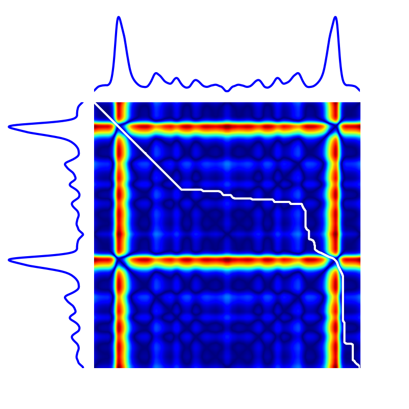

---
jupyter:
  jupytext:
    formats: md
    text_representation:
      extension: .md
      format_name: markdown
      format_version: '1.1'
      jupytext_version: 1.2.1
  kernelspec:
    display_name: Python 3
    language: python
    name: python3
---

# A bit of background

In the following, we present two similarity measures that are discussed in more
details in Sections XX and YY.

## Dynamic Time Warping

Dynamic Time Warping (DTW)  is a similarity measure
between time series.
Let us consider two time series $x = (x_0, \dots, x_{n-1})$ and
$y = (y_0, \dots, y_{m-1})$ of respective lengths $n$ and
$m$.
Here, all elements $x_i$ and $y_j$ are assumed to lie in the same
$d$-dimensional space.

<!-- #region {"tags": ["popout"]} -->
**Note.** In ``tslearn``, such time series would be represented as arrays of
respective
shapes `(n, d)` and `(m, d)` and DTW can be computed using the following code:

```python
from tslearn.metrics import dtw, dtw_path

dtw_score = dtw(x, y)
# Or, if the path is also
# an important information:
path, score = dtw_path(x, y)
```
<!-- #endregion -->

### Optimization problem

DTW between $x$ and $y$ is formulated as the following
optimization problem:

\begin{equation}
DTW(x, y) = \min_\pi \sqrt{ \sum_{(i, j) \in \pi} d(x_i, y_j)^2 }
\label{eq:dtw}
\end{equation}


where $\pi = [\pi_0, \dots , \pi_{K-1}]$ is a path that satisfies the
following properties:

* it is a list of index pairs $\pi_k = (i_k, j_k)$ with
  $0 \leq i_k < n$ and $0 \leq j_k < m$
* $\pi_0 = (0, 0)$ and $\pi_{K-1} = (n - 1, m - 1)$
* for all $k > 0$ , $\pi_k = (i_k, j_k)$ is related to
  $\pi_{k-1} = (i_{k-1}, j_{k-1})$ as follows:

  * $i_{k-1} \leq i_k \leq i_{k-1} + 1$
  * $j_{k-1} \leq j_k \leq j_{k-1} + 1$

Here, a path can be seen as a temporal alignment of time series such that
Euclidean distance between aligned (ie. resampled) time series is minimal.

The following image exhibits the DTW path (in white) for a given pair of time
series, on top of the cross-similarity matrix that stores $d(x_i, y_j)$
values.

<!-- #region {"tags": ["popout"]} -->
**Note.** Code to produce such visualization is available in [``tslearn``'s
Gallery of
examples](https://tslearn.readthedocs.io/en/latest/auto_examples/plot_dtw.html).
<!-- #endregion -->



### Algorithmic solution

There exists an $O(mn)$ algorithm to compute the exact optimum for this
problem:

```python
def dtw(x, y):
  for i in range(n):
    for j in range(m):
      dist = d(x[i], y[j]) ** 2
      if i == 0 and j == 0:
        C[i, j] = dist
      else:
        C[i, j] = dist + min(C[i-1, j] if i > 0
                                       else inf,
                             C[i, j-1] if j > 0
                                       else inf,
                             C[i-1, j-1] if (i > 0 and j > 0)
                                         else inf)

  return sqrt(C[n, m])
```


### Properties

Dynamic Time Warping holds the following properties:

* $\forall x, y, DTW(x, y) \geq 0$
* $\forall x, DTW(x, x) = 0$

However, mathematically speaking, DTW is not a valid distance since it does
not satisfy the triangular inequality.

### Setting additional constraints

The set of temporal deformations to which DTW is invariant can be reduced by
setting additional constraints on the set of acceptable paths.
These constraints typically consist in forcing paths to lie close to the
diagonal.

First, the Sakoe-Chiba band is parametrized by a radius $r$ (number of
off-diagonal elements to consider, also called warping window size sometimes),
as illustrated below:


<!-- #region {"tags": ["popout"]} -->
**Note.** The corresponding code in ``tslearn`` would be:

```python
from tslearn.metrics import dtw
cost = dtw(
  x, y,
  global_constraint="sakoe_chiba",
  sakoe_chiba_radius=3
)
```
<!-- #endregion -->





Second, the Itakura parallelogram sets a maximum slope $s$ for alignment
paths, which leads to a parallelogram-shaped constraint:

<!-- #region {"tags": ["popout"]} -->
**Note.** The corresponding code in ``tslearn`` would be:

```python
from tslearn.metrics import dtw
cost = dtw(
  x, y,
  global_constraint="itakura",
  itakura_max_slope=2.
)
```
<!-- #endregion -->





## Optimal Transport

**TODO**: Wasserstein and Gromov-Wasserstein

## References


