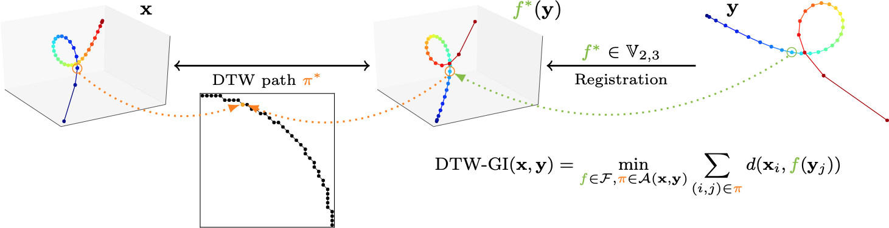

---
jupyter:
  jupytext:
    formats: ipynb,md,Rmd,py:percent
    text_representation:
      extension: .md
      format_name: markdown
      format_version: '1.1'
      jupytext_version: 1.2.1
  kernelspec:
    display_name: Python 3
    language: python
    name: python3
---

# DTW with Global Invariances

<!-- #region {"tags": ["popout"]} -->
**Note.** This work was part of Titouan Vayer's PhD thesis.
We were co-supervising Titouan together with Laetitia Chapel and Nicolas Courty.
<!-- #endregion -->

In this work we address the problem of comparing time series while taking
into account both feature space transformation and temporal variability.
The proposed framework combines a latent global transformation of the feature
space with the widely used Dynamic Time Warping (DTW).
This work is available as preprint .

## Definition

Let $\mathbf{x}$ and $\mathbf{x^\prime}$ be two time series of respective
lengths $n$ and $m$.
Here, features from both time series are not assumed to lie in the same ambient
space, but it is assumed that features from $\mathbf{x}$ lie in $\mathbb{R}^p$
while features from $\mathbf{x^\prime}$ lie in $\mathbb{R}^{p'}$
In the following, we assume $p \geq p'$ without loss of generality.
In order to allow comparison between time series $\mathbf{x}$ and
$\mathbf{x^\prime}$,
we will optimize on a family of functions $\mathcal{F}$ that map features from
$\mathbf{x^\prime}$ onto the feature space in which features from $\mathbf{x}$
lie. More formally, we define Dynamic Time Warping with Global Invariances
(DTW-GI) as the solution of the following joint optimization problem:

\begin{equation}
    \text{DTW-GI}(\mathbf{x}, \mathbf{x^\prime}) =
        \sqrt{
            \min_{f \in \mathcal{F}, \pi \in \mathcal{A}(\mathbf{x}, \mathbf{x^\prime})}
                \sum_{(i, j) \in \pi} d(x_i, f(x^\prime_j))^2
        } ,
    \label{eq:dtwgi}
\end{equation}

where $\mathcal{F}$ is a family of functions from $\mathbb{R}^{p^\prime}$ to
$\mathbb{R}^{p}$.

This similarity measure estimates both temporal alignment and feature space
transformation between time series simultaneously, allowing the alignment of
time series when the similarity should be defined up to a global transformation.
Time series do not have to lie in the same ambient space, as presented in the
following Figure:





## Optimization

Optimization of the quantity in Equation \eqref{eq:dtwgi} can be performed
_via_ Block Coordinate Descent.
In a nutshell, optimization alternates between the following two steps:

1. for a fixed $f$, determine the optimal alignment path $\pi$ using the DTW
algorithm;
2. for a fixed path $\pi$, the optimal map $f$ (when $\mathcal{F}$ is the
Stiefel manifold) is obtained through Singular Value Decomposition.

Interestingly, this optimization strategy where we alternate between time
series alignment, _i.e._ time correspondences between both time series, and
feature space transform optimization can be seen as a variant of the Iterative
Closest Point (ICP) method in image registration , in
which  nearest neighbors are replaced by matches resulting from DTW alignment.

The resulting algorithm is detailed in the following code:

```python tags=["hide_input"]
import numpy


def path2mat(path):
    max0, max1 = path[-1]
    w_pi = numpy.zeros((max0 + 1, max1 + 1))
    for i, j in path:
        w_pi[i, j] = 1.
    return w_pi
```

```python
import scipy
from tslearn.utils import to_time_series
from tslearn.metrics import dtw_path

def dtw_gi(ts0, ts1, init_p=None, max_iter=20, verbose=False, use_bias=False):
    r"""Compute Dynamic Time Warping with Global Invariance (DTW-GI) similarity
    measure between (possibly multidimensional) time series and return it.

    Parameters
    ----------
    ts0: array of shape (sz0, d0)
        A time series.

    ts1: array of shape (sz1, d1)
        A time series.

    init_p : array of shape (d0, d1) (default: None)
        Initial p matrix for the Stiefel linear map. If None, identity matrix
        is used.

    max_iter : int (default: 20)
        Number of iterations for the iterative optimization algorithm.

    verbose: boolean (default: True)
        Whether information should be printed during optimization

    use_bias: boolean (default: False)
        If True, the feature space map is affine, otherwise it is linear.

    Returns
    -------
    w_pi
        Warping matrix (binary matrix of shape (sz0, sz1))

    p
        Stiefel matrix

    cost
        Similarity score
    """
    ts0_ = to_time_series(ts0, remove_nans=True)
    ts1_ = to_time_series(ts1, remove_nans=True)

    sz0, d0 = ts0_.shape
    sz1, d1 = ts1_.shape

    ts0_m = ts0_.mean(axis=0).reshape((-1, 1))
    ts1_m = ts1_.mean(axis=0).reshape((-1, 1))

    w_pi = numpy.zeros((sz0, sz1))
    if init_p is None:
        p = numpy.eye(d0, d1)
    else:
        p = init_p
    bias = numpy.zeros((d0, 1))

    # BCD loop
    for iter in range(1, max_iter + 1):
        w_pi_old = w_pi
        # Temporal alignment
        path, cost = dtw_path(ts0_, ts1_.dot(p.T) + bias.T)
        if verbose:
            print("Iteration {}: DTW cost: {:.3f}".format(iter, cost))
        w_pi = path2mat(path)
        if numpy.allclose(w_pi, w_pi_old):
            break
        # Feature space registration
        if use_bias:
            m = (ts0_.T - ts0_m).dot(w_pi).dot(ts1_ - ts1_m.T)
        else:
            m = (ts0_.T).dot(w_pi).dot(ts1_)
        u, sigma, vt = scipy.linalg.svd(m, full_matrices=False)
        p = u.dot(vt)
        if use_bias:
            bias = ts0_m - ts1_m.T.dot(p.T).T
    path, cost = dtw_path(ts0_, ts1_.dot(p.T) + bias.T)
    if verbose:
        print("After optimization: DTW cost: {:.3f}".format(cost))
    if use_bias:
        return w_pi, p, bias, cost
    else:
        return w_pi, p, cost
```

## Results

We show that one can compute barycenters for this metric (using a similar
approach as the DTW Barycenter Averaging from ),
even when time series to be averaged do not lie in the same ambient space:

```python tags=["hide_input"]
def _set_weights(w, n):
    """Return w if it is a valid weight vector of size n, and a vector of n 1s
    otherwise.
    """
    if w is None or len(w) != n:
        w = numpy.ones((n,))
    return w


def _init_avg(X, barycenter_size):
    if ts_size(X[0]) == barycenter_size:
        return numpy.nanmean(X, axis=0)
    else:
        X_avg = numpy.nanmean(X, axis=0)
        xnew = numpy.linspace(0, 1, barycenter_size)
        f = interp1d(numpy.linspace(0, 1, X_avg.shape[0]), X_avg,
                     kind="linear", axis=0)
        return f(xnew)


def _mm_assignment(X, barycenter, weights, list_init_p=None,
                   metric_params=None):
    """Computes item assignement based on DTW alignments and return cost as a
    bonus.

    Parameters
    ----------
    X : numpy.array of shape (n, sz, d)
        Time-series to be averaged

    barycenter : numpy.array of shape (barycenter_size, d)
        Barycenter as computed at the current step of the algorithm.

    weights: array
        Weights of each X[i]. Must be the same size as len(X).

    list_init_p: list of arrays of shape (d, d)
        Initial P matrices

    metric_params: dict or None (default: None)
        Key-value parameters for f_dtw

    Returns
    -------
    list_W_pi
        List of warping matrices

    list_p
        List of mapping matrices

    float
        Current alignment cost
    """
    if metric_params is None:
        metric_params = {}
    n = len(X)
    if list_init_p is None:
        list_init_p = [numpy.eye(Xi.shape[1], barycenter.shape[1]).T
                       for Xi in X]
    cost = 0.
    list_w_pi = []
    list_p = []
    list_bias = []
    for i in range(n):
        w_pi, p_i, bias_i, dist_i = dtw_gi(barycenter, X[i],
                                           init_p=list_init_p[i],
                                           use_bias=True,
                                           **metric_params)
        cost += dist_i ** 2 * weights[i]
        list_w_pi.append(w_pi)
        list_p.append(p_i)
        list_bias.append(bias_i)
    cost /= weights.sum()
    return list_w_pi, list_p, list_bias, cost


def _subgradient_valence_warping(list_w_pi, weights):
    """Compute Valence and Warping matrices from paths.

    Valence matrices are denoted :math:`V^{(k)}` and Warping matrices are
    :math:`W^{(k)}` in [1]_.

    This function returns a list of :math:`V^{(k)}` diagonals (as a vector)
    and a list of :math:`W^{(k)}` matrices.

    Parameters
    ----------
    list_w_pi : list of arrays of shape (sz_bar, sz_i)
        List of warping matrices

    weights: array
        Weights of each X[i]. Must be the same size as len(X).

    Returns
    -------
    list of numpy.array of shape (barycenter_size, )
        list of weighted :math:`V^{(k)}` diagonals (as a vector)

    list of numpy.array of shape (barycenter_size, sz_k)
        list of weighted :math:`W^{(k)}` matrices

    References
    ----------

    .. [1] D. Schultz and B. Jain. Nonsmooth Analysis and Subgradient Methods
       for Averaging in Dynamic Time Warping Spaces.
       Pattern Recognition, 74, 340-358.
    """
    list_v_k = []
    list_w_k = []
    for k, w_pi in enumerate(list_w_pi):
        list_w_k.append(w_pi * weights[k])
        list_v_k.append(w_pi.sum(axis=1) * weights[k])
    return list_v_k, list_w_k


def _mm_valence_warping(list_w_pi, weights):
    """Compute Valence and Warping matrices from paths.

    Valence matrices are denoted :math:`V^{(k)}` and Warping matrices are
    :math:`W^{(k)}` in [1]_.

    This function returns the sum of :math:`V^{(k)}` diagonals (as a vector)
    and a list of :math:`W^{(k)}` matrices.

    Parameters
    ----------
    list_w_pi : list of arrays of shape (sz_bar, sz_i)
        list of Warping matrices

    barycenter_size : int
        Size of the barycenter to generate.

    weights: array
        Weights of each X[i]. Must be the same size as len(X).

    Returns
    -------
    numpy.array of shape (barycenter_size, )
        sum of weighted :math:`V^{(k)}` diagonals (as a vector)

    list of numpy.array of shape (barycenter_size, sz_k)
        list of weighted :math:`W^{(k)}` matrices

    References
    ----------

    .. [1] D. Schultz and B. Jain. Nonsmooth Analysis and Subgradient Methods
       for Averaging in Dynamic Time Warping Spaces.
       Pattern Recognition, 74, 340-358.
    """
    list_v_k, list_w_k = _subgradient_valence_warping(
        list_w_pi=list_w_pi,
        weights=weights)
    diag_sum_v_k = numpy.zeros(list_v_k[0].shape)
    for v_k in list_v_k:
        diag_sum_v_k += v_k
    return diag_sum_v_k, list_w_k


def _mm_update_barycenter(X, diag_sum_v_k, list_w_k):
    """Update barycenters using the formula from Algorithm 2 in [1]_.

    Parameters
    ----------
    X : numpy.array of shape (n, sz, d)
        Time-series to be averaged

    diag_sum_v_k : numpy.array of shape (barycenter_size, )
        sum of weighted :math:`V^{(k)}` diagonals (as a vector)

    list_w_k : list of numpy.array of shape (barycenter_size, sz_k)
        list of weighted :math:`W^{(k)}` matrices

    Returns
    -------
    numpy.array of shape (barycenter_size, d)
        Updated barycenter

    References
    ----------

    .. [1] D. Schultz and B. Jain. Nonsmooth Analysis and Subgradient Methods
       for Averaging in Dynamic Time Warping Spaces.
       Pattern Recognition, 74, 340-358.
    """
    d = X[0].shape[-1]
    barycenter_size = diag_sum_v_k.shape[0]
    sum_w_x = numpy.zeros((barycenter_size, d))
    for k, (w_k, x_k) in enumerate(zip(list_w_k, X)):
        sum_w_x += w_k.dot(x_k[:ts_size(x_k)])
    barycenter = numpy.diag(1. / diag_sum_v_k).dot(sum_w_x)
    return barycenter
```

```python
from sklearn.exceptions import ConvergenceWarning
from tslearn.utils import to_time_series, ts_size

def dtw_gi_barycenter_averaging(X, barycenter_size=None, init_barycenter=None,
                                max_iter=30, tol=1e-5, weights=None,
                                metric_params=None, keep_p_matrices=False,
                                verbose=False):
    """DTW-GI Barycenter Averaging (DBA) method estimated through
    Expectation-Maximization algorithm.

    DBA was originally presented in [1]_.
    This implementation is based on a idea from [2]_ (Majorize-Minimize Mean
    Algorithm).

    Here, the transform is of the form x -> Ax + b where A lies on the Stiefel
    manifold.

    Parameters
    ----------
    X : array-like, shape=(n_ts, sz, d)
        Time series dataset.

    barycenter_size : int or None (default: None)
        Size of the barycenter to generate. If None, the size of the barycenter
        is that of the data provided at fit
        time or that of the initial barycenter if specified.

    init_barycenter : array or None (default: None)
        Initial barycenter to start from for the optimization process.

    max_iter : int (default: 30)
        Number of iterations of the Expectation-Maximization optimization
        procedure.

    tol : float (default: 1e-5)
        Tolerance to use for early stopping: if the decrease in cost is lower
        than this value, the
        Expectation-Maximization procedure stops.

    weights: None or array
        Weights of each X[i]. Must be the same size as len(X).
        If None, uniform weights are used.

    metric_params: dict or None (default: None)
        DTW constraint parameters to be used.
        See :ref:`tslearn.metrics.dtw_path <fun-tslearn.metrics.dtw_path>` for
        a list of accepted parameters
        If None, no constraint is used for DTW computations.

    keep_p_matrices: bool (default: False)
        Whether P matrices from previous iteration should be used to initialize
        P matrices for the current iteration

    verbose : boolean (default: False)
        Whether to print information about the cost at each iteration or not.

    Returns
    -------
    numpy.array of shape (barycenter_size, d) or (sz, d) if barycenter_size \
            is None
        DBA barycenter of the provided time series dataset.

    float
        Corresponding cost (weighted sum of alignment costs)

    References
    ----------
    .. [1] F. Petitjean, A. Ketterlin & P. Gancarski. A global averaging method
       for dynamic time warping, with applications to clustering. Pattern
       Recognition, Elsevier, 2011, Vol. 44, Num. 3, pp. 678-693

    .. [2] D. Schultz and B. Jain. Nonsmooth Analysis and Subgradient Methods
       for Averaging in Dynamic Time Warping Spaces.
       Pattern Recognition, 74, 340-358.
    """
    X_ = [to_time_series(Xi, remove_nans=True) for Xi in X]
    if barycenter_size is None:
        barycenter_size = ts_size(X_[0])
    weights = _set_weights(weights, len(X_))
    if init_barycenter is None:
        barycenter = _init_avg(X_, barycenter_size)
    else:
        barycenter = init_barycenter
    cost_prev, cost = numpy.inf, numpy.inf
    list_p = [numpy.eye(Xi.shape[1], barycenter.shape[1]).T for Xi in X_]
    for it in range(max_iter):
        if not keep_p_matrices:
            list_p = None
        list_w_pi, list_p, list_bias, cost = _mm_assignment(
            X_,
            barycenter,
            weights,
            list_init_p=list_p,
            metric_params=metric_params
        )
        diag_sum_v_k, list_w_k = _mm_valence_warping(list_w_pi, weights)
        if verbose:
            print("[DBA] epoch %d, cost: %.3f" % (it + 1, cost))
        rotated_x = [numpy.empty(Xi.shape) for Xi in X_]
        for i in range(len(X_)):
            rotated_x[i] = X_[i].dot(list_p[i].T) + list_bias[i].T
        barycenter = _mm_update_barycenter(rotated_x, diag_sum_v_k, list_w_k)
        if abs(cost_prev - cost) < tol:
            break
        elif cost_prev < cost:
            warnings.warn("DBA loss is increasing while it should not be. "
                          "Stopping optimization.", ConvergenceWarning)
            break
        else:
            cost_prev = cost
    return barycenter, cost
```

```python tags=["hide_input"]
%config InlineBackend.figure_format = 'svg'
import matplotlib.pyplot as plt

plt.ion()

# A list of data generation / plotting utils

def has_3d(dataset):
    for sample in dataset:
        if sample.shape[-1] == 3:
            return True
    return False


def plot_trajectory(ts, ax, plot_3d=False, color_code=None, alpha=1.):
    if color_code is not None:
        colors = [color_code] * len(ts)
    else:
        colors = plt.cm.jet(numpy.linspace(0, 1, len(ts)))
    for i in range(len(ts) - 1):
        if plot_3d:
            ax.plot(ts[i:i+2, 0], ts[i:i+2, 1], ts[i:i+2, 2],
                    marker='o', c=colors[i], alpha=alpha)
        else:
            ax.plot(ts[i:i+2, 0], ts[i:i+2, 1],
                    marker='o', c=colors[i], alpha=alpha)


def get_rot2d(theta):
    return numpy.array(
        [[numpy.cos(theta), -numpy.sin(theta)],
         [numpy.sin(theta), numpy.cos(theta)]]
    )


def get_rot3d(alpha, beta, gamma):
    R_alpha = numpy.array(
        [[1., 0., 0.],
         [0., numpy.cos(alpha), -numpy.sin(alpha)],
         [0., numpy.sin(alpha), numpy.cos(alpha)]]
    )
    R_beta = numpy.array(
        [[numpy.cos(beta), 0., numpy.sin(beta)],
         [0., 1., 0.],
         [-numpy.sin(beta), 0., numpy.cos(beta)]]
    )
    R_gamma = numpy.array(
        [[numpy.cos(gamma), -numpy.sin(gamma), 0.],
         [numpy.sin(gamma), numpy.cos(gamma), 0.],
         [0., 0., 1.]]
    )
    return R_alpha.dot(R_beta).dot(R_gamma)


def make_one_spiral(sz, noise=.5):
    uniform_in_01 = numpy.random.rand(sz, 1)
    non_uniform_in_01 = numpy.power(uniform_in_01, 4)
    n = numpy.sqrt(non_uniform_in_01) * 780 * (2 * numpy.pi) / 360
    n = numpy.sort(n.reshape((-1, ))).reshape((-1, 1))
    d1x = -numpy.cos(n) * n + numpy.random.rand(sz, 1) * noise
    d1y = numpy.sin(n) * n + numpy.random.rand(sz, 1) * noise
    arr = numpy.array(numpy.hstack((d1x, d1y)))
    return arr / numpy.max(n)


def make_spirals(n, sz, noise=.5, shift=False, some_3d=False):
    dataset = []
    for i in range(n):
        if some_3d and i % 2 == 0:
            spiral = make_one_spiral(sz=sz, noise=0.)
            spiral = numpy.hstack((spiral, noise * numpy.random.randn(sz, 1)))
            alpha = (numpy.random.rand(1)[0] - .5) * numpy.pi / 2
            beta = (numpy.random.rand(1)[0] - .5) * numpy.pi / 2
            gamma = (numpy.random.rand(1)[0] - .5) * numpy.pi / 2
            spiral = numpy.dot(spiral, get_rot3d(alpha, beta, gamma))
            if shift:
                spiral += numpy.random.rand(3) * 3
        else:
            spiral = make_one_spiral(sz=sz, noise=noise)
            theta = numpy.random.rand(1)[0] * 2 * numpy.pi
            spiral = numpy.dot(spiral, get_rot2d(theta))
            if shift:
                spiral += numpy.random.rand(2) * 3
        dataset.append(spiral)
    return dataset


def make_one_folium(sz, a=1., noise=.1, resample_fun=None):
    theta = numpy.linspace(0, 1, sz)
    if resample_fun is not None:
        theta = resample_fun(theta)
    theta -= .5
    theta *= .9 * numpy.pi
    theta = theta.reshape((-1, 1))
    r = a / 2 * (4 * numpy.cos(theta) - 1. / numpy.cos(theta))
    x = r * numpy.cos(theta) + numpy.random.rand(sz, 1) * noise
    y = r * numpy.sin(theta) + numpy.random.rand(sz, 1) * noise
    return numpy.array(numpy.hstack((x, y)))


def make_folia(n, sz, noise=.1, shift=False, some_3d=False):
    if some_3d:
        raise NotImplementedError
    dataset = []
    for _ in range(n):
        spiral = make_one_folium(sz=sz, a=1., noise=noise)
        theta = numpy.random.rand(1)[0] * 2 * numpy.pi
        spiral = numpy.dot(spiral, get_rot2d(theta))
        if shift:
            spiral += numpy.random.rand(2) * 3
        dataset.append(spiral)
    return dataset
```


```python
import numpy as numpy
import matplotlib.pyplot as plt
from mpl_toolkits.mplot3d import Axes3D
from tslearn.barycenters import dtw_barycenter_averaging

numpy.random.seed(0)

# Parameters of the experiment
n_spirals = 3
n_spirals_shown = 3
sz = 50
sz_barycenter = 25
d_barycenter = 2

# Datasets
list_dataset_generators = [
    lambda n, sz: make_folia(n, sz=sz, shift=False, some_3d=False),
    lambda n, sz: make_spirals(n, sz=sz, noise=.01, shift=False, some_3d=True)
]

# Methods
list_barycenter_fun = [
    lambda dataset, sz, b: dtw_barycenter_averaging(dataset,
                                                    init_barycenter=b,
                                                    barycenter_size=sz,
                                                    max_iter=200),
    lambda dataset, sz, b: dtw_gi_barycenter_averaging(dataset,
                                                       init_barycenter=b,
                                                       barycenter_size=sz,
                                                       verbose=False,
                                                       max_iter=1000,
                                                       keep_p_matrices=True,
                                                       metric_params={
                                                           "max_iter": 1000
                                                       })[0]
]
list_method_names = ["DTW", "DTW-GI"]

angles_visu = [90, numpy.nan, -120]

fig = plt.figure(figsize=(.67 * (3 * n_spirals_shown + len(list_barycenter_fun)),
                          2. * len(list_dataset_generators)))
for idx_dataset, dataset_fun in enumerate(list_dataset_generators):
    spirals = dataset_fun(n_spirals, sz)

    # Plot sample spirals
    for i in range(n_spirals_shown):
        if spirals[i].shape[-1] == 3:
            ax = fig.add_subplot(len(list_dataset_generators),
                                 n_spirals_shown + len(list_barycenter_fun),
                                 (n_spirals_shown + len(list_barycenter_fun))
                                 * idx_dataset + i + 1, projection="3d")
            plot_trajectory(spirals[i], ax=ax, plot_3d=True)
            ax.set_zticks([])
            ax.view_init(elev=20., azim=angles_visu[i])
        else:
            ax = fig.add_subplot(len(list_dataset_generators),
                                 n_spirals_shown + len(list_barycenter_fun),
                                 (n_spirals_shown + len(list_barycenter_fun))
                                 * idx_dataset + i + 1)
            plot_trajectory(spirals[i], ax=ax)
        ax.set_xticks([])
        ax.set_yticks([])
        if idx_dataset == 0:
            ax.set_title("Sample {}".format(i + 1))

    # Plot barycenters
    for i, (barycenter_fun, title) in enumerate(zip(list_barycenter_fun,
                                                    list_method_names)):
        init_b = numpy.random.randn(sz_barycenter, d_barycenter)
        if title == "DTW" and has_3d(spirals):
            continue
        barycenter = barycenter_fun(spirals, sz_barycenter, init_b)
        ax = plt.subplot(len(list_dataset_generators),
                         n_spirals_shown + len(list_barycenter_fun),
                         (n_spirals_shown + len(list_barycenter_fun))
                         * idx_dataset +
                         n_spirals_shown + i + 1)
        plot_trajectory(barycenter, ax=ax)
        ax.set_xticks([])
        ax.set_yticks([])
        if idx_dataset == 0:
            ax.set_title(title)
```

We also introduce soft counterparts following the definition of softDTW from
.

We validate the utility of this new metric on real world
datasets on the tasks of human motion prediction (where motion is captured under
different points of view) and cover song identification (where song similarity
is defined up to a key transposition).
In both these settings, we observe that joint optimization on feature space
transformation and temporal alignment improves over standard techniques that
consider these as two independent steps.

## References


