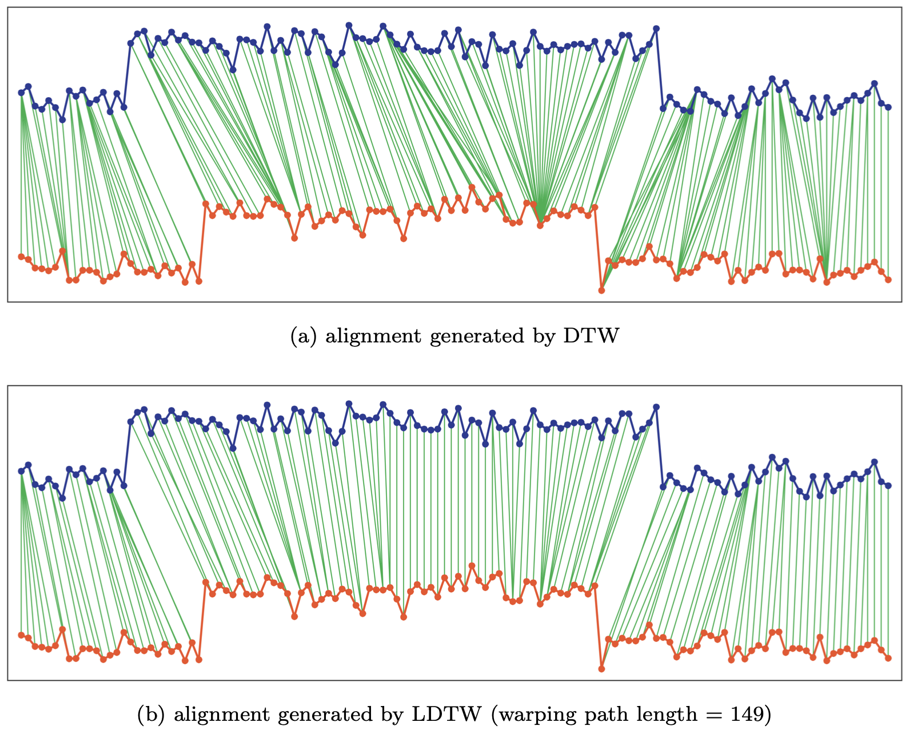

---
jupyter:
  jupytext:
    formats: md
    text_representation:
      extension: .md
      format_name: markdown
      format_version: '1.1'
      jupytext_version: 1.2.1
  kernelspec:
    display_name: Python 3
    language: python
    name: python3
---

# Constrained Dynamic Time Warping

<!-- #region {"tags": ["popout"]} -->
**Note.** This work was a part of Zheng Zhang's PhD thesis. It was performed
during Zheng's stay at LETG in 2015-2016.
<!-- #endregion -->

In this section, we present a method to regularize Dynamic Time Warping (DTW)
by setting constraints on the length of the admissible warping paths
.

## Formulation and Optimization

<!-- #region {"tags": ["popout"]} -->
**Note.** The method is available in ``tslearn`` via:

```python
from tslearn.metrics import dtw_limited_warping_length
cost = dtw_limited_warping_length(
  x, y,
  max_length
)
```
<!-- #endregion -->

As discussed in [Sec. 1.1.1](background.html), a common way to restrict the set
of admissible temporal distortions for Dynamic Time Warping consists in forcing
path to lie stay close to the diagonal through the use of Sakoe-Chiba band or
Itakura parallelogram constraints.
A limitation of these global constraints is that they completely
discard some regions of the alignment matrix _a priori_ (_i.e._ whatever the
data at stake).

On the contrary, we propose Limited warping path length DTW (LDTW) that
adds a path length constraint to the DTW
optimization problem such that a path is said admissible for our method iff:

* it is an admissible DTW path;
* its length $K$ is lower or equal to a user-defined bound $K_\text{max}$.

We have proposed an algorithm that stores, at each step $(i, j)$, optimal
alignment scores for all admissible alignment path lengths.
This gives the general LDTW algorithm:

```python
def ldtw(x, y, max_length):
  for i in range(n):
    for j in range(m):
      dist = d(x[i], y[j]) ** 2
      C[i, j, :] = inf  # Set infinite cost for non-admissible lengths
      # The core difference with DTW is the following line:
      for l in admissible_lengths(i, j, max_length):
        if i == 0 and j == 0:
          C[i, j, l] = dist
        else:
          C[i, j, l] = dist + min(C[i-1, j, l-1] if i > 0
                                                 else inf,
                                  C[i, j-1, l-1] if j > 0
                                                 else inf,
                                  C[i-1, j-1, l-1] if (i > 0 and j > 0)
                                                   else inf)

  return sqrt(min(C[n, m, :]))
```

The question is then to compute the set `admissible_lengths(i, j, max_length)`.
We have shown that this set is actually rather simple to compute and its length
is $O(\min(i, j))$.
Overall, we have a $O(mn^2 + nm^2)$ complexity for this exact algorithm.

## Empirical Observations

First, one can see in the following figure that the resulting alignments
effectively limits the number of singularities in the obtained alignments as
compared to DTW.





Moreover, we have shown through experiments on UCR Time Series Datasets that
this similarity measure, when used in a 1-Nearest Neighbor Classifier, led to
higher accuracy than its competitors DTW and its constrained versions
(Sakoe-Chiba band and Itakura parallelogram).

## References


