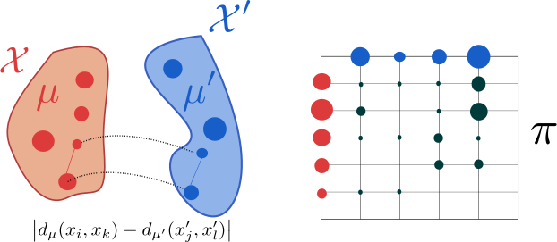

---
jupyter:
  jupytext:
    formats: md
    text_representation:
      extension: .md
      format_name: markdown
      format_version: '1.1'
      jupytext_version: 1.2.1
  kernelspec:
    display_name: Python 3
    language: python
    name: python3
---

# Optimal Transport for Structured Data

This section covers my works related to Optimal Transport distances for
structured data such as graphs.
In order to compare graphs, we have introduced the Fused Gromov Wasserstein
distance that interpolates between Wasserstein distance between node feature
distributions and Gromov-Wasserstein distance between structures.

<!-- #region {"tags": ["popout"]} -->
**Note.** This work was part of Titouan Vayer's PhD thesis.
We were co-supervising Titouan together with Laetitia Chapel and Nicolas Courty.
<!-- #endregion -->

Here, we first introduce both Wasserstein and Gromov-Wasserstein distances and
some of our results concerning computational considerations related to the
latter.

## Wasserstein and Gromov-Wasserstein distances

Let $\mu = \sum_i h_i \delta_{x_i}$ and $\mu' = \sum_i h^\prime_i \delta_{x^\prime_i}$
be two
discrete distributions lying in the same metric space $(\Omega, d)$.
Then, the $p$-Wasserstein distance is defined as:

<!-- #region {"tags": ["popout"]} -->
**Note** that the 2-Wasserstein distance is very similar in its formulation to
the Dynamic Time Warping similarity presented in [Sec. 1.2](dtw.html).
The only difference lies in the constraints that are enforced in the
optimization problems.
For Wasserstein, a coupling needs to meet marginal constraints to be considered
valid while for Dynamic Time Warping, a path shall (i) not break the order of
the sequences at stake and (ii) enforce alignment of complete series (from
beginning to end).
<!-- #endregion -->

\begin{equation}
    W_p(\mu, \mu') = \left(
        \min_{\pi \in \Pi(\mu, \mu^\prime)}
            \sum_{i,j} d(x_i, x^\prime_j)^p \pi_{i,j} \right)^{\frac{1}{p}}
    \label{eq:wass}
\end{equation}

where $\Pi(\mu, \mu^\prime)$ is the set of all admissible couplings between
$\mu$ and $\mu'$ (_ie._ the set of all matrices with marginals $h$ and $h'$).

This distance is illustrated in the following Figure:


When distributions $\mu$ and $\mu'$ do not lie in the same ambient space,
however, one cannot compute their Wasserstein distance. An alternative that was
introduced in  relies on matching intra-domain
distances, as illustrated below:



The corresponding distance is the Gromov-Wasserstein distance, defined as:

\begin{equation}
    GW_p(\mu, \mu') = \left(
        \min_{\pi \in \Pi(\mu, \mu^\prime)}
            \sum_{i,j,k,l}
            \left| d_\mu(x_i, x_k) - d_{\mu'}(x^\prime_j, x^\prime_l) \right|^p
            \pi_{i,j} \pi_{k,l}
        \right)^{\frac{1}{p}}
    \label{eq:gw}
\end{equation}

where $d_\mu$ (resp. $d_{\mu'}$) is the metric associated to $\mathcal{X}$
(resp. $\mathcal{X}^\prime$), the space in which $\mu$ (resp. $\mu'$) lies.

### Sliced Gromov-Wasserstein

Computational complexity associated to the optimization problem in
Equation \eqref{eq:gw} is high in general.
However, we have shown in  that in the
mono-dimensional case, this problem can be seen as an instance of the Quadratic
Assignment Problem .
We have provided a closed form solution for this instance.
In a nutshell, our solution consists in sorting mono-dimensional distributions
and either matching elements from both distributions in order or in reverse
order, leading to a $O(n \log n)$ algorithm that exactly solves this problem.

Based on this closed-form solution, we were able to introduce a Sliced
Gromov-Wasserstein distance that, similarly to the Sliced Wasserstein distance
, computes similarity between distributions
through projections on random lines.

**TODO: add a summary of Titouan's last findings about GW when they are
stabilized.**

## Fused Gromov-Wasserstein

Here, we focus on comparing structured data which combine a feature
**and** a structure information.
More formally, we consider undirected labeled graphs as tuples of the form $\mathcal{G}=(\mathcal{V},\mathcal{E},\ell_f,\ell_s)$ where
$(\mathcal{V},\mathcal{E})$ are the set of vertices and edges of the graph.
$\ell_f: \mathcal{V} \rightarrow \Omega_f$ is a labelling function which
associates each vertex $v_{i} \in \mathcal{V}$ with a feature
$a_{i}\stackrel{\text{def}}{=}\ell_f(v_{i})$ in some feature metric space
$(\Omega_f,d)$.
We will denote by _feature information_ the set of all the features
$\{a_{i}\}_{i}$ of the graph.
Similarly, $\ell_s: \mathcal{V} \rightarrow \Omega_s$ maps a vertex $v_i$ from
the graph to its structure representation
$x_{i} \stackrel{\text{def}}{=} \ell_s(v_{i})$ in some structure space
$(\Omega_s,C)$ specific to each graph.
$C : \Omega_s \times \Omega_s \rightarrow \mathbb{R_{+}}$ is a symmetric
application which aims at measuring the similarity between the nodes in the
graph.
Unlike the feature space however, $\Omega_s$ is implicit and in practice,
knowing the similarity measure $C$ will be sufficient. With a slight abuse of
notation, $C$ will be used in the following to denote both the structure
similarity measure and the matrix that encodes this similarity between pairs of
nodes in the graph $\{C(i,k) = C(x_i, x_k)\}_{i,k}$.
Depending on the context, $C$ can either encode the neighborhood information of
the nodes, the edge information of the graph or more generally it can model a
distance between the nodes such as the shortest path distance.
When $C$ is a metric, such as the shortest-path
distance, we naturally endow the structure with the metric space $(\Omega_s,C)$.
We will denote by _structure information_ the set of all the structure
embeddings $\{x_{i}\}_i$ of the graph.
We propose to enrich the previously described graph with a histogram which
serves the purpose of signaling the relative importance of the vertices in the
graph.
To do so, we equip graph vertices with weights $\{h_{i}\}_{i}$ that sum to $1$.

All in all, we define _structured data_ as a
tuple $\mathcal{S}=(\mathcal{G},h_{\mathcal{G}})$ where $\mathcal{G}$ is a
graph as described previously and $h_{\mathcal{G}}$ is a function that
associates a weight to each vertex. This definition allows the graph to be
represented by a fully supported probability measure over the product space
feature/structure $\mu= \sum_{i=1}^{n} h_{i} \delta_{(x_{i},a_{i})}$ which
describes the entire structured data:


### Distance definition and properties

Let $\mathcal{G}$ and $\mathcal{G}'$ be two graphs, described respectively
by their probability measure $\mu= \sum_{i=1}^{n} h_{i} \delta_{(x_{i},a_{i})}$
and $\mu' = \sum_{i=1}^{m} h^\prime_i \delta_{(x^\prime_i,a^\prime_i)}$.
Their structure matrices are denoted $C$ and $C'$, respectively.


We define a novel Optimal Transport discrepancy called the
Fused Gromov-Wasserstein distance.
It is defined, for a trade-off parameter  $\alpha \in [0,1]$, as

\begin{equation}
\label{discretefgw}
FGW_{q, \alpha} (\mu, \mu') = \min_{\pi \in \Pi(\mu, \mu^\prime)}
    E_{q}(\mathcal{G}, \mathcal{G}', \pi)
\end{equation}

where $\pi$ is a transport map (_i.e._ it has marginals $h$ and $h'$) and

\begin{equation}
E_{q}(\mathcal{G}, \mathcal{G}', \pi) =
    \sum_{i,j,k,l} (1-\alpha) d(a_{i},a^\prime_j)^{q}
                    +\alpha |C(i,k)-C'(j,l)|^{q} \pi_{i,j}\pi_{k,l} .
\end{equation}

The FGW distance looks for the coupling $\pi$ between vertices of the
graphs that minimizes the cost $E_{q}$ which is a linear combination of a cost
$d(a_{i},a^\prime_j)$ of transporting one feature $a_{i}$ to a feature $a^\prime_j$
and a cost $|C(i,k)-C'(j,l)|$ of transporting pairs of nodes in each structure.
As such, the optimal coupling tends to associate pairs of feature and
structure points with similar distances within each structure pair and with
similar features.
As an important feature of FGW, by relying on a sum of
(inter- and intra-)vertex-to-vertex distances, it can handle structured data
with continuous attributed or discrete labeled nodes
(depending on the definition of $d$) and can also be computed even if the graphs
have different numbers of nodes.

We have shown in  that FGW retains the following
properties:

* it defines a metric for $q=1$ and a semi-metric for $q >1$;
* varying $\alpha$ between 0 and 1 allows to interpolate between the
Wasserstein distance between the features and the Gromov-Wasserstein distance
between the structures;

We also define a continuous counterpart for FGW which comes with a
concentration inequality in .

We have presented a Conditional Gradient algorithm for optimization on the
above-defined loss.
We have also exposed a Block Coordinate Descent algorithm to compute graph
barycenters _w.r.t._ FGW.

### Results

We show that FGW allows to extract meaningful barycenters:

<!-- #region {"tags": ["popout"]} -->
**Note.** The code provided here uses integration of FGW provided by the
Python Optimal Transport (POT) toolbox.
<!-- #endregion -->

```python tags=["hide_input"]
import numpy as np
import networkx as nx
import matplotlib.pyplot as plt
import matplotlib.colors as mcol
from matplotlib import cm
plt.ion()


def build_noisy_circular_graph(n_nodes, mu=0, sigma=0.3,
                               with_noise=False,
                               structure_noise=False, p=None):
        g = nx.Graph()
        g.add_nodes_from(range(n_nodes))
        for i in range(n_nodes + 1):
            noise = np.random.normal(mu, sigma, 1)[0]
            val = np.sin(2 * i * np.pi / n_nodes)
            g.add_node(i, feature=val + noise if with_noise else val)
            g.add_edge(i, (i + 1) % (n_nodes + 1))
            if structure_noise:
                randomint = np.random.randint(0, p)
                if randomint == 0:
                    if i <= n_nodes - 3:
                        g.add_edge(i, i + 2)
                    elif i == n_nodes - 2:
                        g.add_edge(i, 0)
                    elif i == n_nodes - 1:
                        g.add_edge(i, 1)
        return g


def sp_to_adjacency(C, threshold=1.8):
    new_adj = np.zeros_like(C)
    new_adj[C <= threshold] = 1.
    np.fill_diagonal(new_adj, 0.)
    return new_adj


def graph_colors(g, vmin=0, vmax=7):
    cnorm = mcol.Normalize(vmin=vmin,vmax=vmax)
    cpick = cm.ScalarMappable(norm=cnorm,cmap='viridis')
    cpick.set_array([])
    val_map = {}
    for k, v in nx.get_node_attributes(g, 'feature').items():
        val_map[k]=cpick.to_rgba(v)
    colors=[]
    for node in g.nodes():
        colors.append(val_map[node])
    return colors


def get_features(g):
    l = [v for (k, v) in nx.get_node_attributes(g, 'feature').items()]
    arr = np.array(l)
    if arr.ndim == 1:
        arr = arr.reshape((-1, 1))
    return arr


def draw_graph(g):
    pos = nx.kamada_kawai_layout(g)
    nx.draw(g, pos=pos,
            node_color=graph_colors(g, vmin=-1, vmax=1),
            with_labels=False, node_size=100)


def shortest_path_matrix(g):
    all_paths = nx.shortest_path(g)
    mat = np.zeros((len(g), len(g))) + np.inf
    for i in all_paths.keys():
        for j in all_paths[i].keys():
            mat[i, j] = len(all_paths[i][j])
    np.fill_diagonal(mat, 0.)
    return mat
```

```python
import numpy as np
import networkx as nx
from ot.gromov import fgw_barycenters

np.random.seed(42)

n_graphs = 10
n_graphs_shown = 4

dataset = [
    build_noisy_circular_graph(np.random.randint(15, 25),
                               with_noise=True,
                               structure_noise=True,
                               p=3)
    for _ in range(n_graphs)
]

Cs = [shortest_path_matrix(x) for x in dataset]
ps = [np.ones(len(x)) / len(x) for x in dataset]
Ys = [get_features(g) for g in dataset]

lambdas = np.ones(n_graphs) / n_graphs
n_nodes = 15 # we choose a barycenter with 15 nodes

features, C_matrix = fgw_barycenters(n_nodes, Ys, Cs, ps,
                                     lambdas, alpha=0.95)

# Build graph from barycenter parts (C_matrix and features)
barycenter = nx.from_numpy_matrix(
    sp_to_adjacency(C_matrix, threshold=3.)
)
for i in range(len(features)):
    barycenter.add_node(i, feature=float(features[i]))

# Plot stuff
plt.figure(figsize=(2 * (n_graphs_shown + 1), 2))
for i in range(n_graphs_shown):
    plt.subplot(1, n_graphs_shown + 1, i + 1)
    draw_graph(dataset[i])
    plt.title('Sample %d' % (i + 1))

plt.subplot(1, n_graphs_shown + 1, n_graphs_shown + 1)
draw_graph(barycenter)
plt.title('FGW Barycenter');
```

We also show that these barycenters can be used for graph clustering.

We also exhibit classification results for FGW embedded in a Gaussian kernel
SVM which leads to state-of-the-art performance (even outperforming graph
neural network approaches) on a wide range of graph classification problems.

## References


