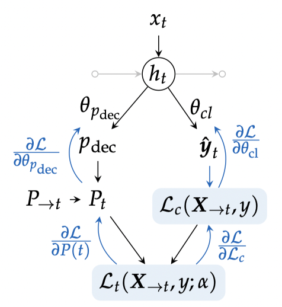

---
jupyter:
  jupytext:
    formats: md
    text_representation:
      extension: .md
      format_name: markdown
      format_version: '1.1'
      jupytext_version: 1.2.1
  kernelspec:
    display_name: Python 3
    language: python
    name: python3
---

# Early Classification of Time Series

Early classification of time series is the task of performing a classification
as early as possible for an incoming time series.
Because of the specificity of this task, I will use in this section the
notation $\mathbf{x}_{\rightarrow t}$ to denote the time series $\mathbf{x}$
truncated after timestamp $t$.

I have worked on two methods for this task.
The first one is a slight improvement over
 and the second one relies on a representation
learning strategy.

## Optimizing a Composite Loss for Early Classification

 introduce a composite loss function for early
classification of time series that balances earliness and accuracy.

The cost function is of the following form:

\begin{equation}
\mathcal{L}(y, \hat{y}, t, \boldsymbol{\theta}) =
    \mathcal{L}_c(y, \hat{y}, \boldsymbol{\theta}) + \alpha t
\label{eq:loss_early}
\end{equation}

where $\hat{y}$ is the class predicted by the model,
$\mathcal{L}_c(\cdot,\cdot,\cdot)$ is a
classification loss and $t$ is the timestamp at which a
decision is triggered by the system.
In this setting, $\alpha$ drives the tradeoff between accuracy and earliness
and is supposed to be a hyper-parameter of the method.

In , they rely on (i) a clustering of the training
time series and (ii) individual classifiers $m_t(\cdot)$ trained at all possible
timestamps, so as to be able to predict, at time $t$, an expected cost for all
times $t + \tau$ with $\tau \geq 0$:

\begin{equation}
    f_\tau(\mathbf{x}_{\rightarrow t}, y) =
        \sum_k P(C_k | \mathbf{x}_{\rightarrow t})
        \sum_i P(y=i | C_k)
        \sum_{j \neq i} P_{t+\tau}(\hat{y} = j | y=i, C_k)
        + \alpha t
        \label{eq:dachraoui}
\end{equation}

where:

* $P(C_k | \mathbf{x}_{\rightarrow t})$ is a soft-assignment weight of
$\mathbf{x}_{\rightarrow t}$ to cluster $C_k$;
* $P(y=i | C_k)$ is obtained from a contingency table that stores the number of
training time series of each class in each cluster;
* $P_{t+\tau}(\hat{y} = j | y=i, C_k)$ is obtained through training time
confusion matrices built on time series from cluster $C_k$ using classifier
$m_{t+\tau}(\cdot)$.

At test time, if a series is observed up to time $t$ and if, for all positive
$\tau$ we have
$f_\tau(\mathbf{x}_{\rightarrow t}, y) \geq f_0(\mathbf{x}_{\rightarrow t}, y)$,
then a decision is made using classifier $m_t(\cdot)$.

### Limitations of the clustering

<!-- #region {"tags": ["popout"]} -->
**Note.** This unpublished note is part of François Painblanc's PhD work.
We are co-supervising François together with Laetitia Chapel, Chloé Friguet and
Pierre Gloaguen.
<!-- #endregion -->

Relying on Equation \eqref{eq:dachraoui} to decide prediction time can be
tricky. We show in the following that in some cases (related to specific
configurations of training time confusion matrices), such an approach will lead
to undesirable behaviors.

Using Bayes rule, Equation \eqref{eq:dachraoui} can be re-written

\begin{eqnarray}
    f_\tau(\mathbf{x}_{\rightarrow t}, y) &=&
        \sum_k P(C_k | \mathbf{x}_{\rightarrow t})
        \sum_i
        \sum_{j \neq i} P_{t+\tau}(\hat{y} = j, y=i | C_k)
        + \alpha t \\
    &=&
        \sum_k P(C_k | \mathbf{x}_{\rightarrow t})
        \underbrace{\sum_i 1 - P_{t+\tau}(\hat{y} = i, y=i | C_k)}_{A_{t+\tau}(k)}
        + \alpha t \\
\end{eqnarray}

where $A_{t+\tau}(k)$ is the sum of off-diagonal elements in the training time
confusion matrix built from time series in cluster $k$ using classifier
$m_{t+\tau}(\cdot)$.

In practice, this means that if the sum of off-diagonal elements of confusion
matrices is equal to the same $A_{t+\tau}$ for all clusters, then this method
will make a decision without taking the data $\mathbf{x}_{\rightarrow t}$
into account:

\begin{eqnarray}
    f_\tau(\mathbf{x}_{\rightarrow t}, y) &=&
        \sum_k P(C_k | \mathbf{x}_{\rightarrow t})
        A_{t+\tau}
        + \alpha t \\
     &=&
        A_{t+\tau} + \alpha t \\
\end{eqnarray}

In other words, for this method to work, it is important that accuracy differs
significantly between clusters, which is a condition that is difficult to ensure
in practice.

### Pushing the Method to the Limit

In , we pushed this method to the limit
where the number of clusters is equal to the number of training time series.
In this case, the limitation exposed above does not hold anymore.

We showed superior loss optimization capabilities with this approach, at the
cost of a larger computational complexity.

We also showed that in order to limit inference time complexity, one could
learn a _decision triggering classifier_ that, based on the time series
$\mathbf{x}_{\rightarrow t}$
observed up to time $t$ predicts whether a decision should be triggered or not.
In this setting, the target values $\gamma_t$ used to train this
_decision triggering classifier_
were computed using the approach described above:

\begin{equation}
    \gamma_t(\mathbf{x}_{\rightarrow t}) = \left\{
        \begin{array}{l}
            1 \text{ if } f_{0}(\mathbf{x}_{\rightarrow t})=\min_{\tau \geq 0}         
                f_{\tau}(\mathbf{x}_{\rightarrow t}) \\
            0 \text{ otherwise. }
        \end{array} \right.
\end{equation}

In other words, decision making is here seen as a two-step process where a
first classifier (_decision triggering classifier_) decides whether a decision
should be made, in which case a
second classifier is used to determine the class to be predicted (the latter
classifier is $m_t(\cdot)$, the same as for other methods).

## Representation Learning for Early Classification

<!-- #region {"tags": ["popout"]} -->
**Note.** This work is part of Marc Rußwurm's PhD work.
Marc is a PhD student from TU Munich who has come to France for a
4-month period in 2018-2019. I was co-supervising Marc with Nicolas Courty
and Sébastien Lefèvre during his stay in France.
<!-- #endregion -->

The previous approach has several shortcomings.
First, it requires to learn a classifier $m_t(\cdot)$ for each possible time
series length $t$, which is very costly.
Second, both classifiers (the one that decides whether a decision should be
made, and the one that actually makes the decision) are seen as independent
models, while they are, in practice, closely related.
Finally, the loss function presented in Equation \eqref{eq:loss_early} requires
a careful choice of hyper-parameter $\alpha$ that might not be easy to pick in
practice.

**TODO: illustrate the problem with Dachraoui's synthetic dataset and 2 very
close $\alpha$ values once the method is integrated in `tslearn`**

We have hence proposed a representation learning framework that
covers these three limitations .

In more details, we rely on a feature extraction module (that can either be
made of convolutional or recurrent submodules) to extract a fixed-sized
representation $h_t$ from an incoming time series $\mathbf{x}_{\rightarrow t}$.
An important point here is that this feature extractor can operate on time
series whatever their length (and hence a different feature extractor need not
to be learned for each time series length).
Then, this feature is provided as input to two different heads, as shown in the
following Figure:

* the first head (left) outputs a probability $P_t$ of making a decision at
time $t$ (given that no decision has been made before): it plays the same role
as the _decision triggering classifier_ presented above;
* the second head is the standard classification head that effectively produces
a classification if the first head triggered it.

Hence, provided that we have a differentiable early classification loss
function, we are able to learn all parameters of this model end-to-end.
Our last contribution in this context is the design of a loss function that
does not lead to dumb optimal solutions (_eg._ trigger all classifications at
the first time stamp, whatever the data).
We introduced the following loss function:

\begin{equation}
    \mathcal{L}(y, \hat{y}, t, \boldsymbol{\theta}) =
        \alpha \mathcal{L}_c(y, \hat{y}, \boldsymbol{\theta})
            - (1-\alpha) P_\boldsymbol{\theta}(\hat{y}=y)
            \left( \frac{T-t}{T} \right)
\end{equation}

where $P_\boldsymbol{\theta}(\hat{y}=y)$ is the probability (as assigned by the
classification model) to generate $y$ as an output.
The second part in this loss function is an earliness reward, which is taken
into account iff the procided decision is sound (_ie._ the correct class is
predicted with non-zero probability).

We have shown that this model outperforms all known baselines in terms of both
time complexity and earliness/accuracy tradeoff, especially for large scale
datasets.
Moreover, we have presented an application of this model to the monitoring of
agriculture, and exposed its ability to trigger class-specific early decisions
in this context in .

## References


