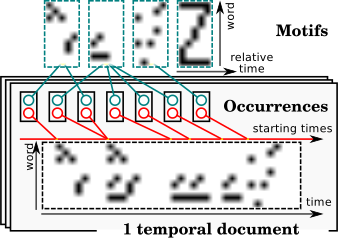

# Temporal Topic Models

Topic models are mixture models that can deal with documents represented as
bags of features (BoF) and extract latent topics (a topic being a distribution
over features) from a corpus of documents.
For these methods, time series are hence seen as bags of timestamped features.
In the methods presented here, the temporal dimension is either
[included in the BoF representation](#Supervised-Hierarchical-Dirichlet-Latent-Semantic-Motifs)
or added
[in a refinement step](#Two-step-Inference-for-Sequences-of-Ornstein-Uhlenbeck-Processes).

## Supervised Hierarchical Dirichlet Latent Semantic Motifs

In this work, we build upon the Hierarchical Dirichlet Latent Semantic Motifs
(HDLSM) topic model that was first introduced in .
This generative model relies on the extraction of motifs that encapsulate the
temporal information of the data.
It is able to automatically find both the underlying number of motifs needed to
model a given set of documents and the number of motif occurrences in each
document (which includes their temporal locations), as shown in the following
Figure:

The HDLSM model takes as input a set of quantized time series.
More specifically, a time series is represented as a table of counts that
informs, for
each pair $(w, t)$, whether word $w$ (typically a quantized feature) was
present in the time series at time index $t$ (in fact, it can also account for
the _amount_ of presence of word $w$ at time $t$).

HDLSM is a generative model whose generative process can be described as
follows:

1. Generate a list of motifs, each motif $k$ being a 2D probability map
indicating how likely it is that word $w$ occurs at relative time $t_r$ after
the beginning of the motif.
2. For each document $j$, generate a list of occurrences, each occurrence having
a starting time $t_o$ and an associated motif $k$.
3. For each observation $i$ in document $j$:
  * Draw an occurrence from the list,
  * Draw a pair $(w, t_r)$ from the associated motif,
  * Generate the observation of word $w$ at time $t = t_o + t_r$.

As stated above, motifs are represented as probabilistic maps.
Each map is drawn from a Dirichlet distribution.
This models makes intensive use of Dirichlet Processes (DP) to model the
possibly infinite number of motifs and occurrences.

To learn the parameters of the model, a Gibbs sampling is applied, in which it
is sufficient to re-sample motif assignments for both observations and
occurrences and starting time for each motif occurrence.
Other variables are either integrated out or deduced, when a deterministic
relation holds.

Our supervised variant relies on the same generative process except that an
extra component is added that maps topics to classes in a supervised learning
context.
Therefore, this mapping needs to be learned and, once the model is trained,
classifying a new instance $\mathbf{x}$ consists in
(i) extracting topic probabilities $P(z | \mathbf{x})$ and
(ii) deriving class probabilities as:

\begin{equation}
    P(y | \mathbf{x}) = \sum_z P(y | z) P(z | \mathbf{x})
\end{equation}

We have used this model in the context of action recognition in videos
.
Here, our _words_ are quantized spatio-temporal features and each time series
is the encoding of a video in which a single action is performed.
In this context, we show that our
model outperforms standard competitors that operate on the same quantized
features.

## Two-step Inference for Sequences of Ornstein Uhlenbeck Processes

## References


